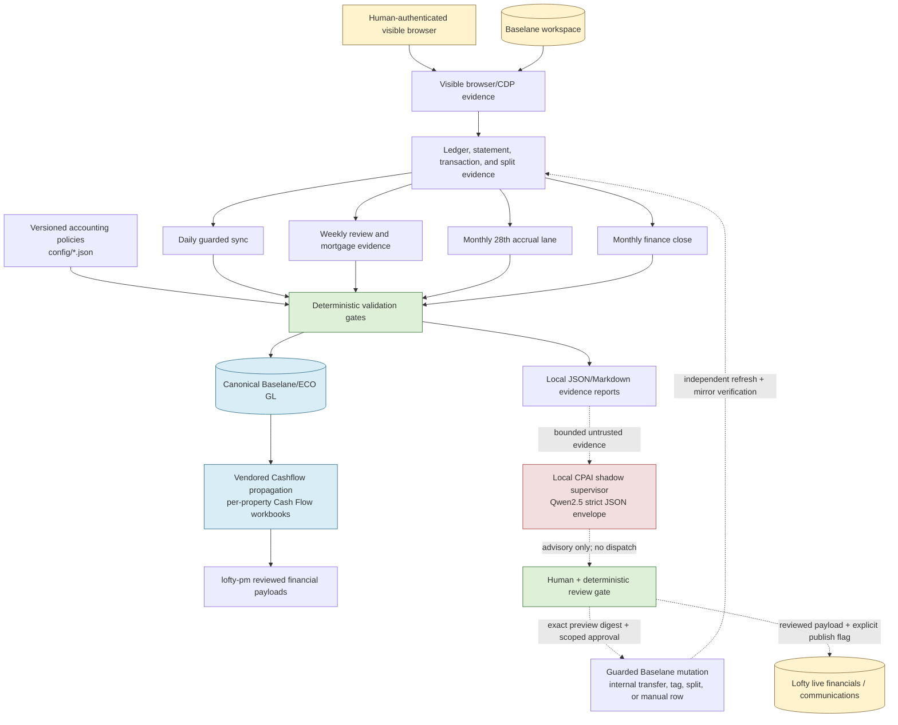

# Baselane → Lofty Workflow

This is the whole operating flow, including its data and authority boundaries. Solid arrows are deterministic data/workflow flow; dashed arrows are review-only or approval-gated paths.

## Authority rules

- Baselane, the canonical ECO GL, and verified source documents establish facts.
- Policies and deterministic guards decide whether evidence is complete enough for the next lane.
- The CPAI can summarize and triage reports only; it cannot create facts or trigger actions.
- Any financial or external action requires the existing preview, scoped approval, independent refresh, and evidence-record protocol in [AGENTS.md](../AGENTS.md).
